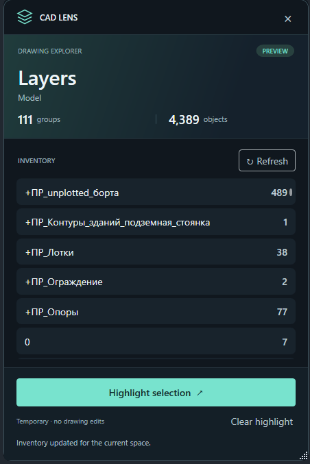

# CAD Lens

CAD Lens is a personal experiment in interfaces for exploring AutoCAD drawings. The idea is inspired by the lenses in Civilization: the same DWG can be viewed through different visual layers, letting users switch context quickly without changing the drawing itself.



## Why this project exists

The goal is to test whether a game-inspired interface can make an unfamiliar drawing easier and more enjoyable to explore. The first useful outcome is a quick understanding of the DWG's structure; more analysis tools may follow as the project develops.

## Possible user scenario

1. The user opens a DWG and runs `CADLENS`.
2. Lens mode opens with a compact panel over the drawing area.
3. The Layers lens shows the number of objects on each included layer.
4. The user selects a layer in the legend and sees its objects temporarily highlighted without changing object or layer properties in the DWG.
5. Closing lens mode removes the temporary visualization.

This is an example for discussion in OpenSpec Explore, not an approved specification for the first feature.

## Possible directions

- Geometry: visual classification of object types.
- Object Inspector: an object card on hover.
- Blocks: block instances and variations.
- Problems: duplicates, gaps, short segments, and other detectable issues.
- History: changes during the current session, if AutoCAD events provide enough information.
- Later: Selection Lens, radial menu, minimap, game elements, and separate Civil 3D/Revit adapters.

These are directions, not commitments for the first release. For example, a historical creation date for every existing DWG object cannot be promised without checking whether the data exists.

## Technical boundaries of the first version

- Hosts: AutoCAD 2025 and 2026 on Windows. Autodesk lists .NET 8 for their original releases; compatibility with later .NET 10 host updates must be checked separately.
- Language and UI: C# and WPF. HUD placement and highlighting must be tested in AutoCAD before the architecture is fixed.
- Analysis is separate from AutoCAD access: read the required snapshot in the proper document context, then calculate aggregates over ordinary .NET models.
- A lens result describes the desired visualization. Clear temporary effects when switching lenses or documents and when closing lens mode.
- The first slice does not require changing DWG geometry or properties.

## Highlighting across views

CAD Lens uses one exploration session for the active drawing. Highlighting and dimming apply to the current inventory objects in every view where those objects are visible, respecting each viewport's visibility settings. Separate selection and navigation state per viewport is outside the scope. Switching drawings or spaces clears the old effects; Focus moves only the active view.

## Project map

- `Common` contains host results, typed ID contracts, and the object visualization contract without WPF or AutoCAD.
- `Common.AutoCAD` owns queued AutoCAD work, database helpers, temporary graphics, and object visualization including Focus and bounds reading.
- `CadLens.Lenses` turns detached drawing snapshots into Layers groups and navigation state.
- `CadLens.UI` owns the window, lens switching, and the Layers WPF module.
- `CadLens.AutoCAD` connects the UI to AutoCAD and owns the plugin and panel lifetime.
- `CadLens.Preview` runs the same UI with sample data.

A Layers refresh travels from `LayersViewModel` through `ILayersActions` to the AutoCAD adapter. The adapter reads a detached snapshot through `LayersLensProvider` and sends object visualization requests to `IObjectVisualizationService`.

## AutoCAD lifetime

`CadLens.AutoCAD` supplies highlight colors and owns plugin/panel lifetime, cleanup, lens snapshot construction, and panel messages. The two `Common` libraries do not reference a CAD Lens project.

Create `AutoCadTaskService` on the host UI thread. Call selection actions on that thread to capture preselection before queuing work. Clear graphics when leaving the drawing context; stop and drain the queue before disposing it. The extracted graphics implementation remains subject to the native rendering checks described below.

## Adding a lens

A lens is an independent module implementing `ILens` in `CadLens.UI`. It supplies its descriptor and WPF view, handles activation/deactivation, and receives context-change, drawing-edit, and close notifications. Its view model, models, services, commands, and XAML are entirely its own.

Register the module and its constructor dependencies in the composition root:

```csharp
services.AddScoped<MyLensService>();
services.AddScoped<MyLensViewModel>();
services.AddScoped<ILens, MyLens>();
```

The shell consumes `IEnumerable<ILens>`, creates toolbar buttons in registration order, and displays the selected module's `View` in a `ContentControl`. Construct views lazily on the UI thread, so discovering registrations does not create WPF content or read drawings. Descriptor IDs must be unique. The shell has no Layers data, navigation, filter, Focus, or highlighting contract.

One module is active at a time. The activation token remains valid until collapse, switching, or close. Deactivation receives a separate cleanup token and must settle module-owned work and remove its effects. Failed cleanup blocks switching until a retry succeeds. `OnContextChanged` invalidates each module's saved context; `OnDrawingChanged` lets the active module decide whether and how to update. `Close` must synchronously cancel work and detach effects, respecting the host-shutdown flag. Module services are scoped to the panel session.

Only `LayersLens` is registered in production. `CadLens.UI/Lenses/Layers` contains `LayersView.xaml`, `LayersViewModel`, and `ILayersActions`; `CadLens.Lenses` contains its provider, presentation models, and navigation. The AutoCAD-specific `LayersActions` supplies its drawing operations. These are Layers implementation details, not interfaces another lens must implement. The shared AutoCAD task queue and host utilities remain available for reuse.

Tests register an unrelated Counter module with its own XAML, view model, service, and Increment command. It appears and runs without changes to the shell.

## Spec-driven development

The project uses OpenSpec. The reasons for that choice and a short guide are in [docs/SDD.md](docs/SDD.md). We agree on behavior and verification criteria in a specification before implementing one testable slice, then compare the result with that specification.

## Current status

The first plugin is implemented. The `autocad-bootstrap` change is archived, and the command requirements live in `openspec/specs/autocad-command/spec.md`. The verification record and its limits are below.

## Build and manually load the first plugin

Build from the repository root:

```powershell
dotnet build CadLens.slnx -c Debug
```

The plugin is built at `src/AutoCAD/CadLens.AutoCAD/bin/Debug/net8.0-windows/CadLens.AutoCAD.dll`. Open a DWG in AutoCAD 2025 or 2026. If the build directory is not in `TRUSTEDPATHS`, copy all DLLs from that output directory into an existing trusted directory without disabling `SECURELOAD`. Run `NETLOAD` and select the DLL from that directory. Then enter `CADLENS` on the command line. The command now opens the CAD Lens preview panel without printing a greeting. New sessions start as a compact bar with Layers inactive and no inventory read. Press Layers to expand and read the active space; automatic refresh runs only while the lens is active. Press Layers again to collapse and clear temporary effects. Reactivation reads fresh data and restores valid navigation and inclusion filters without moving the camera; document/space changes reset navigation. The lens button tooltip reports pending or failed cleanup, and activation waits for pending cleanup to settle. Close remains available throughout. Closing and reopening starts a fresh inactive session with default filters. Use Refresh for an explicit reload, Highlight selection to test temporary emphasis on objects preselected in the drawing, and Clear highlight to restore appearance. Repeated commands bring the existing panel forward while preserving its mode and selection. The preview must not modify stored drawing geometry or properties.

The `lens-panel-and-switching` implementation and remaining native checks are recorded in [panel verification](openspec/changes/lens-panel-and-switching/verification.md).

## Explorer preview status

The `first-layers-lens` change is archived by user acceptance, with remaining verification limits recorded. The current panel uses CommunityToolkit.Mvvm and a WPF UI theme scoped to the window. It supports inclusion filters, group/type/object navigation, breadcrumbs, Back, and Previous/Next with an object counter. Browsing changes panel content without moving the view. Focus explicitly fits the current group or object using live bounds, with an explanation for unavailable bounds, locked layout viewports, or unsupported views. Hidden objects remain hidden. Opening a layer, type, or object now requests temporary emphasis through the existing graphics preview; Back restores broader targets and All clears the effect. The user confirmed navigation/cleanup, full-row clicking, and highlighting/clearing across two visible viewports after the all-viewport regeneration correction; Highlight selection still operates on objects preselected in the drawing. The user confirmed that Focus now works in the tested case; the full native scenario matrix remains open. See [implementation verification](openspec/changes/archive/2026-09-20-first-layers-lens/verification.md) for build/test evidence and the outstanding graphics gate.

## Verification of the first plugin

On September 19, 2026, the plugin was loaded with `NETLOAD` in Autodesk Civil 3D 2026 based on AutoCAD 2026 (`acad.exe`, version 25.1s, .NET 8.0.31). In a new drawing, `CADLENS` printed the greeting used at that time, which contained `CAD Lens`; `DBMOD` was `0` before and after the command. The temporary DLL copy and logging settings used for the check were removed afterward. The greeting was subsequently removed; the current command opens or activates the panel instead.

Separate installations of standard AutoCAD 2025 and 2026 were not found on this machine. Compatibility with those installations has not been verified in the host. The Civil 3D 2026 check was sufficient to finish the first slice.

## GitHub Actions

On every push to any branch, a Windows workflow restores dependencies, builds the solution, and runs `dotnet test`. Core, Lenses, managed host-queue, and UI tests run from `CadLens.slnx`. Native AutoCAD rendering and lifecycle checks are separate.

## Standalone UI preview

Run the real CAD Lens WPF window with sample data, without AutoCAD:

```powershell
dotnet run --project src/CadLens.Preview
```

The window starts compact with the approved Quiet rail design, based on concept A.
Click Layers to browse sample layers, primitive types, and objects. The shared UI keeps the
original dark palette and mint accent, with explicit inclusion labels, hover/press/focus
feedback, and fixed bottom actions. The AutoCAD plugin and preview use the same XAML.
Focus and highlight actions only display simulated status messages; there is no drawing or camera.
The preview appears in the taskbar and closes with its window. Set CadLens.Preview as the startup
project in Rider for quick runs. An in-app variant selector is not implemented yet.

Optional scenarios (restart to change):

```powershell
dotnet run --project src/CadLens.Preview -- --slow
dotnet run --project src/CadLens.Preview -- --empty
dotnet run --project src/CadLens.Preview -- --error
```

`--slow` adds a 1.8-second cancellable delay to simulated operations for busy-state inspection.
`--empty` returns no inventory; `--error` simulates an unavailable inventory. Flags can be combined.
Default sample data includes long names, eight visible layers, and additional frozen/off layers.
This is a UI development host, not verification of native AutoCAD graphics or lifecycle behavior.
