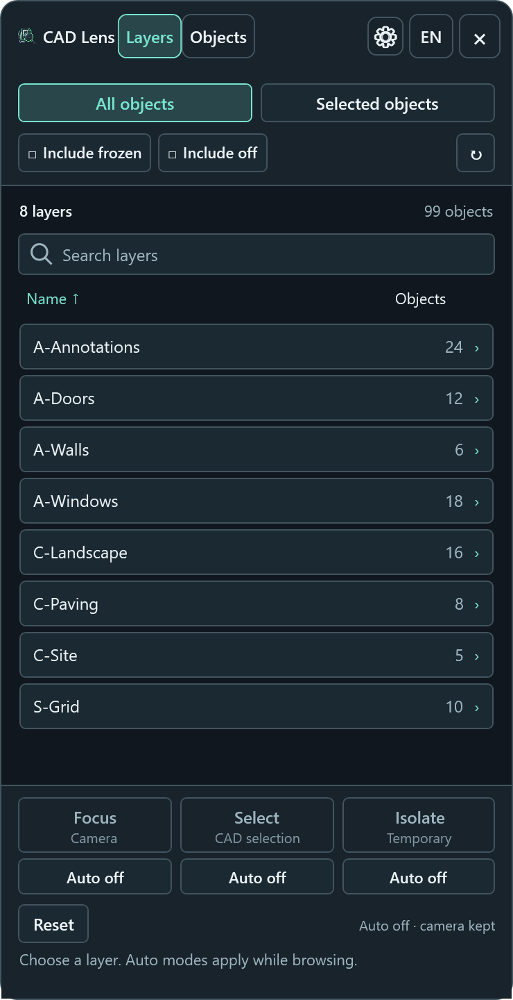

# CAD Lens

CAD Lens is a personal experiment in exploring AutoCAD drawings through game-inspired visual layers. Its lenses help reveal a DWG's structure without changing drawing geometry or properties.

## Contents

- [Overview](#overview)
- [Install and run](#install-and-run)
- [Language](#language)
- [Use the Layers lens](#use-the-layers-lens)
- [Use the Object Types lens](#use-the-object-types-lens)
- [Development](#development)
- [Verification](#verification)
- [Future ideas](#future-ideas)

## Overview

The plugin provides Layers and Object Types. Layers groups objects by layer; Object Types groups the same included active-space objects by type across layers. Both support object details, camera focus, CAD selection, and temporary isolation. The panel stays over the drawing; closing or collapsing it restores the ordinary display.

CAD Lens uses C#, .NET 8, and WPF on Windows. The intended hosts are AutoCAD 2025 and 2026 and their Civil 3D counterparts. The bundle manifest declares AutoCAD release R25.0 as its minimum; compatibility with newer host or .NET runtime updates needs a separate native check. AutoCAD LT is outside the current scope.

## Install and run

### Bundle

Build the bundle from the repository root:

```powershell
./scripts/New-Bundle.ps1
```

The script publishes the plugin, generates `PackageContents.xml`, and creates `artifacts/bundle/CadLens.bundle.zip`. A successful GitHub Actions run also offers that ZIP as a downloadable artifact.

1. Extract the ZIP.
2. Copy the `CadLens.bundle` directory to `%PROGRAMFILES%\Autodesk\ApplicationPlugins`.
3. Restart AutoCAD or Civil 3D, open a DWG, and run `CADLENS`.

The bundle loads the plugin when `CADLENS` is invoked. To update an installation, close the host and replace the entire `CadLens.bundle` directory.

### Manual development load

Build the solution:

```powershell
dotnet build CadLens.slnx -c Debug
```

Debug builds copy the plugin and its dependencies to `%APPDATA%\Autodesk\ApplicationPlugins\CadLens.bundle\Contents`. The entry assembly is `CadLens.AutoCAD.dll` in that directory. Library and test project outputs stay in their local build directories. If the build directory is not in `TRUSTEDPATHS`, copy the complete output directory, including its `ru` satellite-resource subdirectory, into an existing trusted directory without disabling `SECURELOAD`. In AutoCAD, run `NETLOAD`, select `CadLens.AutoCAD.dll`, and enter `CADLENS`. Restart the host before loading rebuilt assemblies from a previously loaded plugin.

## Language

CAD Lens starts with the current user's Windows display language: Russian for a Russian display language,
English for English or any unsupported language. This is independent of Windows regional formatting
and the AutoCAD interface language.

Use the EN/RU button in the header to choose **Use Windows language**, **English**, or **Русский**.
The change applies immediately, including tooltips, details, and status messages, while preserving
navigation, inclusion filters, and drawing effects. Layer names, layout names, entity type names, and
handles remain as supplied by the drawing. Third-party exception details remain in their original language.

The preference is saved per Windows user in `%LOCALAPPDATA%\CadLens\language.json`. An absent or
invalid file uses Windows mode; an unwritable file keeps the selected language for the current session
and shows a save explanation in the menu. Windows mode reads the display language at startup and
when selected again. A Windows display-language change usually also requires Windows sign-out.

## Use the Layers lens

A new `CADLENS` session opens as a compact bar with both lenses inactive. Press Layers to read the active drawing space. Browse layers, object types, and objects with the list, breadcrumbs, Back, and Previous/Next. Use Refresh after drawing edits. Press Layers again to collapse the panel; reopen it to restore valid navigation, inclusion filters, and Auto settings without moving the camera. Pending or failed cleanup appears in the compact status tooltip and can delay reactivation. Running `CADLENS` again brings the existing panel forward.



### Drawing controls

| Action | Effect | Auto default |
| --- | --- | --- |
| Focus | Fits the current target in the active camera | Off |
| Select | Replaces the CAD selection | Off |
| Isolate | Temporarily hides other direct active-space objects | Off |

Each action has its own Auto toggle, and all three start off. Enabled actions follow navigation. For selection without camera movement, turn Auto Select on and leave Auto Focus off. Select remains available when Focus cannot use bounds or the viewport is locked.

### Temporary isolation

Press Isolate on a layer, type, or object to keep its direct active-space objects in their original appearance and temporarily hide the other direct active-space objects. Auto Isolate repeats this as you browse; with Auto Isolate off, the next navigation clears a manual isolation. Objects on off or frozen layers stay hidden even when included in the list. Isolation uses the same target set in every viewport where those objects are visible, without moving cameras or changing CAD selection.

Turning Auto Isolate off, returning to the root list, pressing Reset, collapsing or closing the panel, or switching drawings or spaces restores the ordinary display. Isolation does not write entity or layer visibility properties to the DWG.

Reset also clears CAD selection and turns off all Auto modes while keeping the camera, navigation, and inclusion filters. Effects stay clear during later navigation until a mode is enabled again. Reset is disabled while work is pending. Turning Auto Select off clears only CAD selection. With Auto Select off, a manual selection persists until replaced or cleared. Closing the panel discards session settings.

CAD Lens uses one exploration session for the active drawing. Focus moves only the active view. Switching drawings or spaces reloads the active lens. These actions do not change stored DWG geometry or properties.

## Use the Object Types lens

Press Objects to browse object types across all included layers in the current model or paper space and see their counts. Search the type names or sort by name/count, then browse Type → Object; each object shows its own layer and visibility details. A block insertion counts as one object. Nested block and external-reference contents are not traversed.

Object Types shares the drawing controls and inclusion filters described above. Switching lenses clears the previous lens's selection/isolation and restores the destination lens's valid navigation and settings. Counts include off-screen objects and stay unchanged when panning or zooming. Use Refresh after drawing edits.

## Development

### Project map

- `Common` contains host results, typed ID contracts, and the object visualization contract without WPF or AutoCAD.
- `Common.AutoCAD` owns queued AutoCAD work, database helpers, temporary visual isolation, Focus, and bounds reading.
- `CadLens.Lenses` groups detached drawing inventories by layer or object type and owns navigation state.
- `CadLens.UI` owns the window, lens switching, and the shared object explorer view and view model.
- `CadLens.AutoCAD` connects the UI to AutoCAD and owns plugin and panel lifetime.

Both lenses use `ObjectExplorerViewModel` and `ObjectExplorerView`. A refresh requests its grouping through `IObjectExplorerActions`; the AutoCAD adapter invokes `DrawingLensProvider`, which reads a detached `DrawingInventory` and builds either Layer → Type → Object or Type → Object groups. Drawing actions use the same `IObjectVisualizationService`. Analysis runs over ordinary .NET models after the inventory is read in the proper document context.

### Host and lens lifetime

`CadLens.AutoCAD` owns plugin and panel lifetime, cleanup, snapshot construction, and panel messages. Create `AutoCadTaskService` on the host UI thread. Capture preselection on that thread before queuing selection work. Clear temporary isolation when leaving the drawing context, then stop and drain the queue before disposing it.

A lens implements `ILens` in `CadLens.UI`. It supplies a descriptor and WPF view, handles activation and deactivation, and receives context-change and close notifications. Register its own dependencies and the lens in the composition root:

```csharp
services.AddScoped<MyLensService>();
services.AddScoped<MyLensViewModel>();
services.AddScoped<ILens, MyLens>();
```

The shell discovers `ILens` registrations, creates their views lazily on the UI thread, and shows one active module at a time. Descriptor IDs must be unique. Deactivation must settle module work and remove its effects; failed cleanup blocks switching until a retry succeeds. Context changes invalidate saved targets, and Close cancels work and removes effects before the host queue stops. Module services are scoped to the panel session.

Production registers two `ObjectExplorerLens` instances with different groupings. Each owns its navigation, filters, search, and Auto settings; both reuse one scoped inventory provider and host-action adapter. Shared WPF files live in `src/CadLens.UI/Lenses/ObjectExplorer`, and drawing models/grouping live in `src/CadLens.Lenses/Drawing`. Tests register an unrelated Counter lens to check that the shell still supports other modules.

### CI and releases

Current code and tests describe the supported behavior. Keep documentation for usage, important decisions, and host constraints; ordinary changes do not require separate planning artifacts.

On every push, the Windows GitHub Actions workflow restores dependencies, builds the solution, runs managed tests, and uploads the bundle ZIP. Native AutoCAD rendering and lifecycle checks are separate.

To publish a prerelease, update `Version` in `Directory.Build.props` and merge it into `main`. After a successful build, the workflow creates the `v<Version>` tag and attaches `CadLens.bundle.zip` to the GitHub Release. Runs with an existing release version leave that release unchanged. You can also start the workflow with **Run workflow** or `gh workflow run build.yml --ref main`.

GitHub generates the release description from merged pull request titles, contributors, and a link to the full commit history. Use descriptive pull request titles for changes users should see in release notes.

## Verification

See the [verification guide](docs/verification.md) for managed checks, native AutoCAD scenarios, and the current evidence limits. Build and test results do not establish native rendering, lifecycle, or host compatibility. Earlier Layers and Highlight acceptance does not verify the current Isolate behavior.

## Future ideas

Possible later lenses include geometry classification, object inspection, blocks, drawing problems, and session history where source events support it. Selection Lens, a radial menu, minimap, game elements, and separate adapters are also ideas. These are exploration topics, not committed features; existing DWG objects do not necessarily carry a recoverable creation date.
