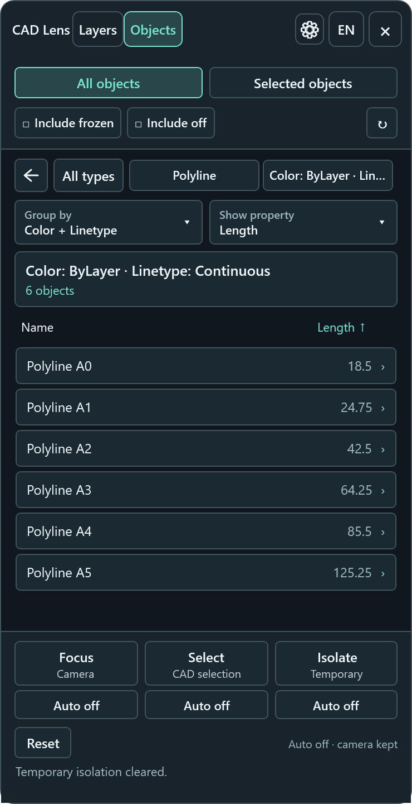

# CAD Lens

[English](README.md) | Русский


Просматривайте объекты чертежа AutoCAD по слоям, типам и свойствам. CAD Lens помогает находить,
выбирать, показывать крупным планом и временно изолировать объекты, не изменяя геометрию
и свойства, сохранённые в DWG.

**[Скачать последнюю версию](https://github.com/vildar82/CadLens/releases)** ·
[Установка](#установка-и-запуск) · [Сообщить о проблеме](https://github.com/vildar82/CadLens/issues)

## Содержание

- [Возможности](#возможности)
- [Установка и запуск](#установка-и-запуск)
- [Язык интерфейса](#язык-интерфейса)
- [Линза «Слои»](#линза-слои)
- [Линза типов объектов](#линза-типов-объектов)
- [Оформление](#оформление)
- [Разработка](#разработка)
- [Проверка](#проверка)

## Возможности

- **Слои:** переходите от слоя к типу и отдельному объекту, чтобы изучить структуру чертежа.
- **Типы объектов:** просматривайте объекты одного типа на разных слоях, изучайте свойства и объединяйте их в группы.
- **Действия с чертежом:** приближайте объекты, выбирайте их в CAD и временно изолируйте нужные элементы.
- **Область просмотра:** работайте со всеми непосредственными объектами текущего пространства или с выбранным набором.
- **Настройки:** выбирайте русский или английский язык, меняйте оформление и сохраняйте отдельные настройки каждой
  линзы.

Панель открывается в виде компактной полосы поверх чертежа. Включите линзу для просмотра объектов.
Сворачивание или закрытие панели снимает временную изоляцию и восстанавливает обычное отображение.
Перетаскивайте панель за свободное место в заголовке.

Текущая поставка предназначена для **64-разрядной Windows, AutoCAD 2019–2027 и Civil 3D 2019–2027**
и использует WPF. Приложение автоматически выбирает подходящий набор файлов:

| Версия приложения            | Серия AutoCAD | Каталог в поставке         |
|------------------------------|---------------|----------------------------|
| AutoCAD / Civil 3D 2019–2020 | R23.0–R23.1   | `Contents/net47`           |
| AutoCAD / Civil 3D 2021–2024 | R24.0–R24.3   | `Contents/net48`           |
| AutoCAD / Civil 3D 2025      | R25.0         | `Contents/net8.0-windows`  |
| AutoCAD / Civil 3D 2026      | R25.1         | `Contents/net8.0-windows`  |
| AutoCAD / Civil 3D 2027      | R26.0         | `Contents/net10.0-windows` |

API версий 2019, 2021 и 2025 используется для соответствующих диапазонов версий.
AutoCAD 2027 использует API 2027 и .NET 10.
См. [таблицу совместимости .NET от Autodesk](https://help.autodesk.com/cloudhelp/2027/ENU/AutoCAD-Customization/files/GUID-A6C680F2-DE2E-418A-A182-E4884073338A.htm).
Для версий 2019–2020 требуется .NET Framework 4.7, для 2021–2024 — .NET Framework 4.8.
Подходит и совместимая более поздняя версия .NET Framework 4.x;
см. [руководство Microsoft по версиям и зависимостям](https://learn.microsoft.com/en-us/dotnet/framework/install/versions-and-dependencies).
Это целевые версии приложений; совместимость нужно проверять в каждом приложении с учётом его обновлений.
AutoCAD 2018 и более ранние версии, AutoCAD LT и macOS не входят в текущую область поддержки.

Снимок ниже показывает рабочий WPF-интерфейс на демонстрационных данных. Он иллюстрирует интерфейс,
но не подтверждает поведение внутри AutoCAD или Civil 3D. См. раздел [«Проверка»](#проверка).

## Установка и запуск

### Скачивание и установка

1. Откройте [последний выпуск на GitHub](https://github.com/vildar82/CadLens/releases) и скачайте **CadLens.bundle.zip**
   из раздела **Assets**.
2. Распакуйте архив и скопируйте весь каталог `CadLens.bundle` в `%PROGRAMFILES%\Autodesk\ApplicationPlugins`.
3. Перезапустите AutoCAD или Civil 3D, откройте DWG и нажмите **CAD Lens** на вкладке ленты **Plug-Ins** либо выполните
   `CADLENS`.
4. Нажмите **Слои** или **Объекты** на компактной панели, чтобы просмотреть текущее пространство чертежа.

Плагин загружается при вызове `CADLENS`. Учитывайте ограничения проверки, указанные в описании выпуска
и [руководстве по проверке](docs/verification.md). Сведения о локальных настройках, диагностических
экспортах и внешних ссылках приведены в [политике конфиденциальности](docs/privacy-policy.md).
Эти документы доступны на английском языке.

Для обновления закройте приложение и замените весь каталог `CadLens.bundle` новым.
Для удаления закройте приложение и удалите этот каталог. Не заменяйте DLL плагина, пока приложение запущено.

### Ручная загрузка при разработке

Установите SDK .NET 8 и .NET 10, а также среду выполнения .NET Framework 4.8 или 4.8.1.
Собирайте решение с помощью SDK .NET 10. Эталонные сборки .NET Framework восстанавливаются через NuGet;
отдельный Developer Pack не требуется:

```powershell
dotnet build CadLens.slnx -c Debug
```

Debug-сборка копирует плагин и зависимости в
`%APPDATA%\Autodesk\ApplicationPlugins\CadLens.bundle\Contents\<TargetFramework>`.
Для ручного `NETLOAD` выберите `CadLens.AutoCAD.dll` из `net47` для 2019–2020,
`net48` для 2021–2024, `net8.0-windows` для 2025–2026 или `net10.0-windows` для 2027,
затем выполните `CADLENS`. Результаты сборки библиотек и тестов остаются в их локальных каталогах.
Если каталог сборки отсутствует в `TRUSTEDPATHS`, скопируйте весь подходящий выходной каталог,
включая подкаталог ресурсов `ru`, в уже доверенный каталог, не отключая `SECURELOAD`.
Перед загрузкой пересобранных сборок ранее загруженного плагина перезапустите приложение.

## Язык интерфейса

При запуске CAD Lens использует язык интерфейса Windows текущего пользователя:
русский для русскоязычной Windows, английский для английского и остальных неподдерживаемых языков.
Это не зависит от региональных форматов Windows и языка интерфейса AutoCAD.

Кнопка EN/RU в заголовке позволяет выбрать язык Windows, **English** или **Русский**.
Переключение применяется сразу, включая подсказки, свойства и сообщения состояния.
Навигация, фильтры включения и эффекты в чертеже сохраняются. Имена слоёв, листов, типов сущностей
и идентификаторы остаются такими, как в чертеже. Подробности сторонних исключений сохраняют исходный язык.

Настройка хранится для текущего пользователя Windows в `%LOCALAPPDATA%\CadLens\language.json`.
Если файл отсутствует или повреждён, используется язык Windows. Если сохранить файл нельзя,
выбранный язык действует до конца сеанса, а меню объясняет проблему сохранения.
Режим языка Windows считывает язык интерфейса при запуске и при повторном выборе этого режима.
Смена языка интерфейса самой Windows обычно также требует выхода из учётной записи.

## Линза «Слои»

Новый сеанс `CADLENS` открывает компактную панель с выключенными линзами. Нажмите **Слои**:
текущее пространство загрузится автоматически, если содержит не более 10 000 непосредственных объектов.
Для большего пространства нажмите «Обновить», чтобы загрузить всё, или выберите **Выбранные объекты**.
Переходите между слоями, типами и объектами с помощью списка, цепочки навигации и кнопок
возврата, предыдущего и следующего объекта. После правок чертежа обновите данные.

Повторное нажатие **Слои** сворачивает панель. При открытии восстанавливаются актуальная навигация,
фильтры включения и автоматические режимы без перемещения камеры. Незавершённая или неудачная очистка
эффектов отображается в подсказке состояния компактной панели и может задержать включение линзы.
Повторный вызов `CADLENS` выводит уже открытую панель на передний план.

### Область просмотра

Обе линзы начинают с режима **Все объекты**: непосредственные объекты текущего пространства модели или листа.
При превышении 10 000 объектов автоматическая загрузка останавливается до чтения их свойств.
Явное обновление и переключение области просмотра могут загрузить всё пространство.
Выбранные объекты загружаются сразу независимо от размера всего пространства.

Чтобы изменить порог, закройте панель и задайте `AutoLoadObjectLimit` в файле настроек каждой линзы:
`%LOCALAPPDATA%\CadLens\lens-layers.json` или `lens-object-types.json`.
Ноль откладывает загрузку любого непустого пространства; отрицательное значение использует порог по умолчанию.
При повторном открытии линзы и изменении фильтров включения используются уже загруженные данные.
После редактирования чертежа нажмите «Обновить».

Каждое нажатие **Выбранные объекты**, даже в уже активном режиме, использует текущее выделение CAD.
Если выделения нет, плагин предлагает выбрать объекты и сразу читает их. Escape отменяет выбор,
сохраняя предыдущий результат. Учитываются только существующие непосредственные объекты текущего
пространства. Фильтры отключённых и замороженных слоёв продолжают действовать.

Навигация, группировка, изменение фильтров включения, сброс и выбор объектов используют сохранённый
снимок данных. Сворачивание панели и переключение линз также сохраняют выбранный набор и навигацию
каждой линзы. Обновление выбранных объектов заново использует выделение CAD или предлагает выбор;
оно может заменить набор результатом ручного или автоматического выбора через CAD Lens.
Смена чертежа или пространства очищает прежние данные и возвращает режим **Все объекты**.
С него же начинается каждый новый сеанс панели.

### Действия с чертежом

| Действие | Результат                                                                  | Автоматический режим по умолчанию |
|----------|----------------------------------------------------------------------------|-----------------------------------|
| Focus    | Показывает текущий набор крупным планом в активном виде                    | Выключен                          |
| Select   | Заменяет выделение объектов в CAD                                          | Выключен                          |
| Isolate  | Временно скрывает остальные непосредственные объекты текущего пространства | Выключен                          |

У каждого действия есть свой переключатель Auto. Изначально все три выключены;
сохранённые настройки восстанавливаются отдельно для каждой линзы. Включённые действия следуют за навигацией.
Чтобы выбирать объекты без перемещения камеры, включите Auto Select и оставьте Auto Focus выключенным.
Select доступен и тогда, когда Focus не может получить границы или видовой экран заблокирован.

### Временная изоляция

Isolate на слое, типе или объекте сохраняет исходный вид целевых объектов и временно скрывает
остальные непосредственные объекты текущего пространства. Auto Isolate повторяет изоляцию при навигации.
Если Auto Isolate выключен, следующий переход снимает ручную изоляцию.
Объекты на отключённых или замороженных слоях остаются скрытыми, даже если включены в список.
Изоляция действует на тот же набор во всех видовых экранах, где он виден, не перемещая камеры и не меняя выделение CAD.

Выключение Auto Isolate, возврат к корневому списку, сброс, сворачивание или закрытие панели,
а также смена чертежа или пространства восстанавливают обычное отображение.
Изоляция не записывает свойства видимости сущностей или слоёв в DWG.

Сброс также очищает выделение CAD и выключает все автоматические режимы, сохраняя камеру,
навигацию и фильтры включения. Выключенные режимы сохраняются в настройках.
Эффекты остаются снятыми при последующих переходах, пока режим не будет включён снова.
Сброс недоступен во время выполнения операции. Выключение Auto Select очищает только выделение CAD.
При выключенном Auto Select ручное выделение сохраняется до явной замены или очистки.

Линзы независимо сохраняют фильтры включения, поисковый текст, колонку и направление сортировки,
а также автоматические режимы в `%LOCALAPPDATA%\CadLens`. Настройки восстанавливаются после закрытия
панели или перезапуска приложения. Панель по-прежнему начинает работу свёрнутой, а новый сеанс —
с корневого списка без старых целей и навигации, привязанных к чертежу.
При сворачивании или закрытии сохраняются ширина и высота развёрнутой панели.
При открытии размеры восстанавливаются в пределах рабочей области текущего монитора; положение окна не сохраняется.
Восстановленные автоматические режимы применяются при выборе цели. Если сохранить настройки нельзя,
элементы управления продолжают работать в текущем сеансе, а состояние линзы сообщает о проблеме.

CAD Lens использует один сеанс просмотра для активного чертежа. Focus меняет только активный вид.
Смена чертежа или пространства очищает прежние данные и автоматически загружает активную линзу
в пределах порога размера. Эти действия не меняют геометрию или свойства, сохранённые в DWG.

## Линза типов объектов

Нажмите **Объекты**, чтобы просмотреть типы и количество объектов на всех включённых слоях текущего
пространства модели или листа. Ищите по имени типа, сортируйте по имени или количеству и переходите
от типа к объекту. Для каждого объекта показаны слой и сведения о видимости.
Вставка блока считается одним объектом. Вложенные блоки и содержимое внешних ссылок не обходятся.



Здесь действуют те же действия с чертежом и фильтры включения. Переключение линзы очищает выделение
и изоляцию предыдущей линзы, затем восстанавливает актуальные настройки и навигацию новой.
Количество включает объекты за пределами экрана и не меняется при панорамировании или масштабировании.
После правок чертежа обновите данные.

Внутри типа строка объекта показывает характерное измерение: вершины полилинии, непосредственные
сущности определения блока, контуры штриховки, управляющие точки сплайна, длину отрезка,
радиус окружности или дуги, высоту текста. **Show property** позволяет выбрать наблюдаемое свойство
для строки и сортировки по значению. Числа сортируются как числа; текст и назначенные свойства
используют свои типизированные значения. Нажатие заголовка колонки значений меняет направление сортировки;
переходы к предыдущему и следующему объекту следуют этому порядку. Недоступные значения показаны тире
и располагаются в конце. Геометрические расстояния используют единицы чертежа, веса линий — миллиметры.
Выбор свойства сохраняется для каждой линзы и типа. Строка группы показывает количество объектов;
откройте её, чтобы выбрать отображаемое свойство отдельных объектов.

**Площадь** доступна для всех кривых и штриховок в свойствах, отображении значения и группировке.
Значения, которые может вычислить AutoCAD, также участвуют в числовой фильтрации.
Площадь выражается в квадратных единицах чертежа с точностью `LUPREC`.
Для незамкнутых плоских кривых используется площадь AutoCAD с прямым замыканием между концами.
Если расчёт недоступен, в том числе для неподдерживаемых или неплоских кривых и при ошибке штриховки,
показывается тире, а не ноль. Корректный нулевой результат остаётся нулём.

Десятичные измерения показываются с точностью до `LUPREC` знаков, углы — в градусах с точностью `AUPREC`.
Конечные нули отбрасываются. Количества остаются целыми, веса линий сохраняют миллиметровую точность.
Числовая группировка использует те же округлённые значения: одинаково отображаемая `Площадь: 0`
образует одну группу, отдельную от недоступных значений (`—`). Обновление применяет изменённую точность
к строкам, составу групп, подписям, свойствам и подсказкам. Значения объектов, сортировка и числовые
фильтры сохраняют точные исходные числа; группа с отображаемым нулём может содержать малые ненулевые значения.

**Group by** объединяет свойства, например цвет + тип линии + вес линии или образец штриховки + угол.
Каждое сочетание создаёт подгруппу с количеством объектов и действиями с чертежом.
Снимите флажки, чтобы вернуться к отдельным объектам. Выбор группировки сохраняется отдельно
для каждой линзы и типа. Группировка и сортировка используют последний снимок данных;
обновление перечитывает свойства чертежа.

Теги атрибутов и динамические свойства блоков доступны в тех же списках отображения, группировки
и фильтрации. Префиксы **Атрибут: TAG** и **Дин. свойство: Name** отличают их от обычных свойств:
атрибут `Layer` не совпадает со встроенным свойством слоя. Имена и текст атрибутов сохраняются
как в чертеже; текст `002` не преобразуется в число. Динамические свойства сохраняют исходные
числовые единицы или текст. Отсутствующие, нечитаемые и повторяющиеся одноимённые значения недоступны
для группировки и фильтрации; пустой текст остаётся отдельным значением.
Сохранённые свойства и именованные фильтры используют эти ключи между сеансами и чертежами.
После изменения значений блока в CAD обновите данные. Эти элементы управления не редактируют значения блоков.
Список содержит свойства, наблюдаемые у объектов текущего типа, включая измерения.

Внутри типа откройте **Filter**, выберите свойство, сравнение и значение, затем нажмите **Apply**.
Например, можно найти незамкнутые полилинии, длины ниже порога или объекты заданного цвета.
Числовые сравнения используют точные значения: расстояния вводятся в единицах чертежа, углы — в градусах.
Текст сравнивается без учёта регистра. Недоступные значения не подходят ни под одно условие,
включая «не равно». При ошибке ввода сохраняется предыдущий результат. **Clear** снимает условие,
в том числе при отсутствии подходящих объектов.

Каждая линза хранит один фильтр для каждого типа в текущем сеансе панели.
В линзе слоёв условие действует на этот тип и на других слоях. Количества, группы свойств и действия
используют подходящие объекты. Изменение фильтра работает со снимком данных; обновление перечитывает чертёж.
Фильтры сохраняются при навигации и переключении линз, но очищаются при смене чертежа или пространства.
В **Filter → Saved filters** можно сохранить корректное условие под именем для текущего типа.
Обе линзы используют общие сохранённые условия из `property-filters.json` в каталоге настроек.
Применение работает с текущими данными и областью просмотра; удаление сохранённого условия не снимает
уже применённое. Сохранённые фильтры не содержат идентификаторов объектов чертежа.
Условия по слою находят сохранённое имя в текущем чертеже.

При изменении подходящего набора включённые автоматические режимы следуют за результатом,
а ручная изоляция снимается. Ручное выделение CAD сохраняется до явной замены или очистки.
Если совпадений нет, выделение и изоляция очищаются, камера сохраняется.

Группировка сравнивает назначенные значения, различая ByLayer, ByBlock, индексные и истинные цвета,
а также записи цветовых книг. Числовые ключи учитывают точность чертежа, сохраняя тип и единицы.
Локализованные подписи не определяют идентичность. Вес линии, постоянная ширина полилинии
и толщина выдавливания — разные свойства.

Вставка блока остаётся одной целью действия. Её структурное измерение считает существующие
непосредственные сущности определения, включая определения атрибутов; вложенная вставка считается один раз.
Атрибуты вставки показаны отдельно. Динамические блоки используют исходное имя и количество
из определения, на которое ссылается вставка. Это не гарантирует количество видимых геометрических элементов.
Содержимое внешних ссылок не считается.

## Оформление

Кнопка с шестерёнкой на компактной панели открывает выбор темы, палитры и акцента.
По умолчанию тема следует за AutoCAD: CAD Lens читает `COLORTHEME` при открытии и реагирует
на последующие изменения темы приложения. Светлая и тёмная темы могут быть выбраны отдельно для CAD Lens.
Палитры Quiet, Graphite и Paper поддерживают обе темы и акценты Mint, Blue, Violet и Amber.

Изменения сразу применяются к панели, обеим линзам и элементам управления.
Восстановление настроек возвращает следование теме AutoCAD, Quiet и Mint.
Настройки текущего пользователя хранятся в `%LOCALAPPDATA%\CadLens\appearance.json`
и сохраняются после закрытия панели или приложения. Повреждённый файл приводит к использованию
настроек по умолчанию; при ошибке записи выбор продолжает действовать в текущем сеансе.
Оформление не меняет тему AutoCAD, чертёж, навигацию или временные эффекты.

Кнопка **CAD Lens ⓘ** открывает сведения о программе, проект GitHub, политику конфиденциальности
и отправку вопросов или предложений через GitHub Issues. Ссылки открываются в браузере по умолчанию.

## Разработка

### Сборка поставки

В корне репозитория выполните:

```powershell
./scripts/New-Bundle.ps1
```

Скрипт публикует все четыре целевые платформы, создаёт `PackageContents.xml` для текущей версии
и архив `artifacts/bundle/CadLens.bundle.zip` с частичным CUIX ленты, локальной справкой
и политикой конфиденциальности. Успешная сборка GitHub Actions также предоставляет ZIP как артефакт;
в GitHub Releases доступны выпуски для пользователей.

### Карта проектов

- `CadLens.Common` содержит результаты операций хоста, типизированные идентификаторы и контракт визуализации без
  зависимостей от WPF и AutoCAD.
- `CadLens.Common.AutoCAD` отвечает за очередь задач AutoCAD, работу с базой, временную изоляцию, Focus и чтение границ.
- `CadLens.Lenses` группирует независимые снимки чертежа по слоям или типам и хранит состояние навигации.
- `CadLens.UI` отвечает за окно, переключение линз и общие View и ViewModel просмотра объектов.
- `CadLens.AutoCAD` связывает UI с AutoCAD и управляет жизненным циклом плагина и панели.

Обе линзы используют `ObjectExplorerViewModel` и `ObjectExplorerView`.
Обновление запрашивает группировку через `IObjectExplorerActions`; адаптер AutoCAD вызывает
`DrawingLensProvider`, который читает независимый `DrawingInventory` и строит
Слой → Тип → Объект либо Тип → Объект. Действия используют общий `IObjectVisualizationService`.
После чтения в допустимом контексте документа анализ работает с обычными моделями .NET.

Все объекты используют `EntitySnapshot` с одним неизменяемым словарём
`DrawingPropertyKey` → `DrawingValue?` для обычных свойств, атрибутов и динамических свойств блоков,
а также необязательным основным измерением строки. `DrawingPropertyKey.Source` различает
BuiltIn, Attribute и DynamicBlock, сохраняя раздельными одинаковые имена разных источников.
Повторяющиеся имена одного источника превращаются в одно недоступное значение;
свойства без читаемого имени пропускаются. `AutoCadEntitySnapshotReader` извлекает данные хоста,
`DrawingProperties` предоставляет общий доступ, а `DrawingLensProvider` строит обе иерархии.
Свойства, составная группировка и числовая сортировка используют одни независимые значения.
Новый обработчик примитива не требует отдельной UI-модели или реализации группировки.

Точность чертежа читается вместе со снимком. `DrawingPrecision` задаёт общее округление
для ключей групп и `DrawingValueFormatter`; исходные значения остаются доступными для свойств,
сортировки и фильтрации.

### Жизненный цикл хоста и линз

`CadLens.AutoCAD` отвечает за жизненный цикл плагина и панели, очистку, создание снимков и сообщения.
Создавайте `AutoCadTaskService` в UI-потоке хоста. Считывайте предварительное выделение в этом потоке
до постановки интерактивного выбора в очередь. При выходе из контекста чертежа снимайте временную
изоляцию, затем останавливайте и освобождайте очередь после завершения её задач.

Линза реализует `ILens` из `CadLens.UI`: предоставляет описание и WPF-представление,
обрабатывает включение и выключение, смену контекста и закрытие.
Регистрируйте её зависимости и саму линзу в корне композиции:

```csharp
services.AddScoped<MyLensService>();
services.AddScoped<MyLensViewModel>();
services.AddScoped<ILens, MyLens>();
```

Оболочка находит регистрации `ILens`, создаёт представления по необходимости в UI-потоке
и показывает один активный модуль. Идентификаторы описаний должны быть уникальны.
Выключение завершает работу модуля и снимает его эффекты; неудачная очистка блокирует переключение
до успешного повтора. Смена контекста делает старые цели недействительными; закрытие отменяет работу
и снимает эффекты до остановки очереди хоста. Сервисы модулей принадлежат области сеанса панели.

Приложение регистрирует две линзы `ObjectExplorerLens` с разными группировками.
У каждой свои навигация, фильтры, поиск и автоматические режимы; поставщик данных и адаптер действий
общие в пределах сеанса. `SettingsService` загружает JSON и атомарно сохраняет настройки языка,
оформления и линз. Общие WPF-файлы находятся в `src/CadLens.UI/Lenses/ObjectExplorer`,
модели и группировка — в `src/CadLens.Lenses/Drawing`. Тесты регистрируют отдельную линзу Counter,
чтобы проверять поддержку других модулей оболочкой.

### CI и выпуски

Текущие код и тесты описывают поддерживаемое поведение. Документация нужна для использования,
важных решений и ограничений хоста; обычные изменения не требуют отдельных планов.

При каждом push Windows-процесс GitHub Actions устанавливает SDK .NET 8 и .NET 10,
восстанавливает зависимости, собирает решение, выполняет управляемые тесты всех четырёх платформ,
создаёт поставку, проверяет загрузку зависимостей старых платформ и публикует ZIP как артефакт.
Проверки отображения и жизненного цикла внутри AutoCAD выполняются отдельно.

Для предварительного выпуска обновите `Version` в `Directory.Build.props` и объедините изменение
с `main`. После успешной сборки процесс создаёт тег `v<Version>` и прикрепляет `CadLens.bundle.zip`
к выпуску GitHub. Если эта версия уже опубликована, выпуск остаётся без изменений.
Процесс можно запустить вручную через **Run workflow** или `gh workflow run build.yml --ref main`.

GitHub формирует описание выпуска из заголовков объединённых pull request, списка участников
и ссылки на полную историю. Пишите конкретные заголовки pull request для изменений,
которые пользователи должны увидеть в описании выпуска.

## Проверка

В [руководстве по проверке](docs/verification.md) на английском языке перечислены управляемые проверки,
сценарии для AutoCAD и текущие границы подтверждённого поведения. Сборка и тесты не подтверждают
отображение, жизненный цикл или совместимость внутри приложения. Раннее подтверждение работы
линзы слоёв и подсветки не проверяет текущее поведение изоляции.